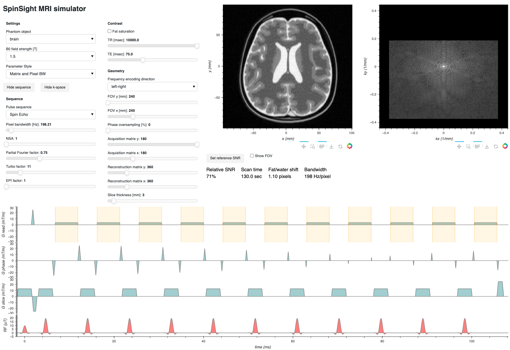

SpinSight MRI simulator
===
SpinSight is an MRI simulator written in Python and created for educational puposes. It jointly visualizes the imaging parameters, the MRI pulse sequence, the k-space data matrix, and the MR image. These are updated in near real-time when the user changes parameters. The simulator is run as a web browser dashboard. The data is simulated from computational 2D phantoms in vector graphics format (SVG).

Running the Simulator
---
SpinSight is served on the local host by running [spinsight/deploy.py](./spinsight/deploy.py) and navigating to [localhost](http://localhost) in the web browser. The same script can be used to deploy the simulator on a local network, or on a web server (run `deploy.py -h` for help).

Dependencies
------------
See [pyproject.toml](./pyproject.toml).

License
-------
SpinSight is distributed under the terms of the GNU General Public License. See [LICENSE.md](./LICENSE.md).

Contact Information
-------------------
Johan Berglund, Ph.D.  
Uppsala University Hospital,  
Uppsala, Sweden  
johan.berglund@akademiska.se

---
Copyright © 2021–2024 Johan Berglund.