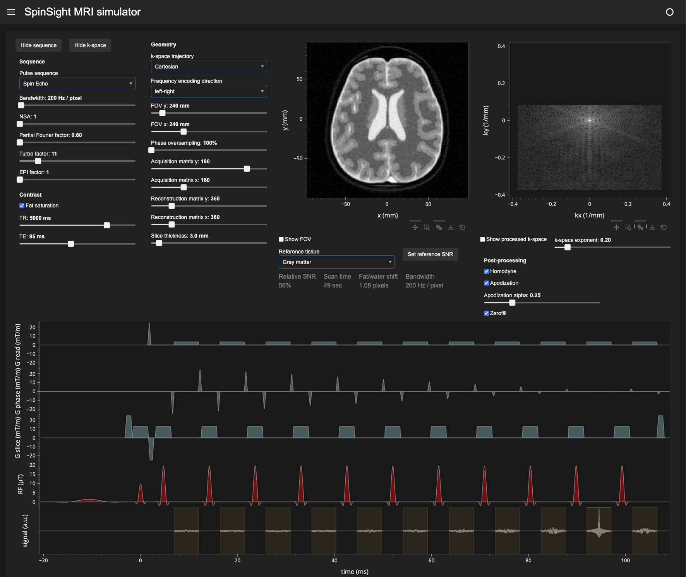

[](https://www.gnu.org/licenses/gpl-3.0)



# SpinSight MRI simulator
SpinSight is an MRI simulator written in Python and created for educational puposes. It jointly visualizes the imaging parameters, the MRI pulse sequence, the k-space data matrix, and the MR image. These are updated in near real-time when the user changes parameters. The simulator is run as a web browser dashboard. The data is simulated from computational 2D phantoms in vector graphics format (SVG).

## Running the Simulator
Install using pip: 
```
pip install spinsight
```
Then run as a command line tool
```
spinsight
```
This serves SpinSight on the local host, so that the simulator can be run by navigating to [localhost](http://localhost) in the web browser. The same command line tool can be used to deploy the simulator on a local network, or on a web server (run `spinsight -h` for help). Be aware that several minutes are required upon loading a phantom for the first time.  

## Phantom construction
To create a new phantom, add a directory with the phantom name under [spinsight/phantoms](./spinsight/phantoms). This directory shall contain files with the same name as the directory. Two formats are supported:

### A single `.toml` file
The file shall consist of a list of shapes (see [Shepp-Logan_shapes.toml](./spinsight/phantoms/Shepp-Logan/Shepp-Logan.toml) for reference). Each shape is assigned a tissue type which must be defined in the `TISSUES` dict in [constants.py](./spinsight/constants.py).

### A pair of `.toml` and `.svg` files
The `.toml` file specifies a mapping from hexcolors to tissues (see [brain.toml](./spinsight/phantoms/brain/brain.toml) for reference). The tissues must be defined in the `TISSUES` dict in [constants.py](./spinsight/constants.py).

The specified `.svg` file must meet the following specifications:
* All paths must be closed
* All paths must have a fill color matching a hexcolor defined in the `.toml` file (this defines the tissue).
* Only polygons are supported (not Bézier curves etc.)


## Dependencies
See [pyproject.toml](./pyproject.toml), *dependencies* under heading **[project]**. 

## How to cite
If you use this software in your research, please cite:

> Berglund J, Jain K, Sousa JM, Hedman K, Fahlström M. “SpinSight – An educational open-source MRI simulator with joint visualization of pulse sequence, k-space, and MR image. In: *Proceedings of the Annual Meeting of the International Society of Magnetic Resonance in Medicine*, Honolulu 2025, pp. 1968.

## License
SpinSight is distributed under the terms of the GNU General Public License. See [LICENSE.md](./LICENSE.md).

## Contact Information
Johan Berglund, Ph.D.  
Uppsala University Hospital,  
Uppsala, Sweden  
johan.berglund@akademiska.se

---
Copyright © 2021–2026 Johan Berglund.